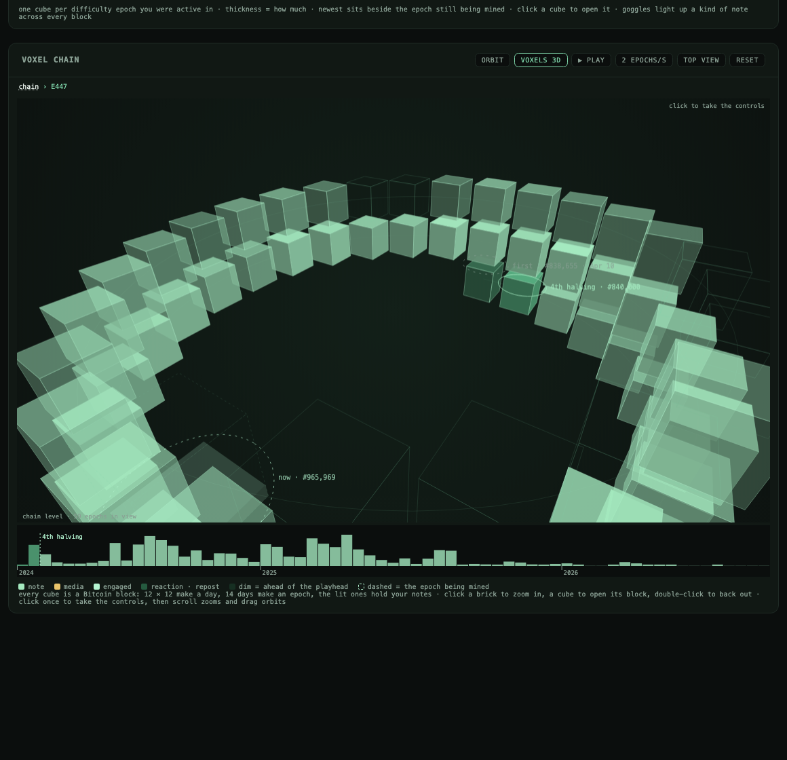
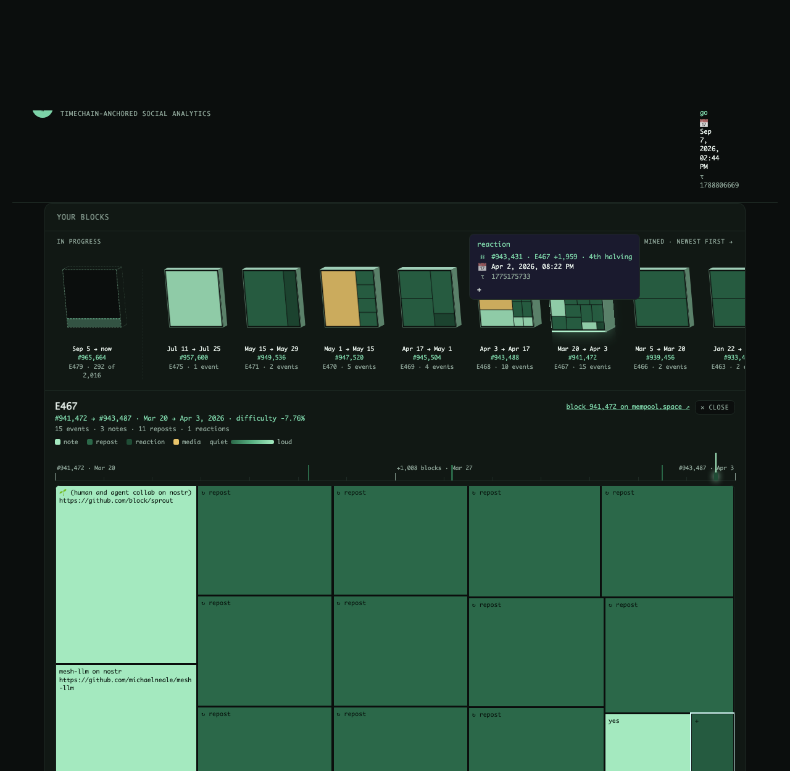

# ronishbhatt.com

A personal website whose pages are signed Nostr events. The HTML shell is 22 lines; everything else (layout, stylesheet, every block of content) is a kind 30078 event signed by the site key, served from a self-hosted [strfry](https://github.com/hoytech/strfry) relay with public relays as backups, verified in the browser, and assembled on the fly. The content is veiled with NIP-44 using a key that is literally the favicon: the 8 × 8 mosaic encodes 32 bytes, one shade of green per hex digit.

Also in this repo: **NOSTR ORBIT**, a timechain view of any Nostr profile (`public/projects/`).



## What is here

- `public/index.html`: the shell. Import map, integrity hashes, a snapshot of event ids, one module script.
- `public/js/`: `boot.js` (the only script a visitor runs until they interact), `store.js` (relay pool, verification, unveiling, the NIP-13 miner), `ui.js`, `chat.js` (NIP-17 gift-wrapped chat gated by proof of work), `garden.js` and the mural (small experiments on top of the relay), `owner.js` (the editor; the owner signs in their own client, keys never touch the server), `wild.js` (the optional visual mode).
- `public/orbit/index.html` and `public/projects/js/orbit/`: NOSTR ORBIT. Timestamps become block heights through the real difficulty schedule (`epochs.js`, refreshed by `tools/epochs.mjs`, merged live from mempool.space, about five blocks either way). Every halving era is a ring. Every Bitcoin block is a voxel: 12 × 12 make a day, 14 days make an epoch, epochs coil upward 26 to a turn so one turn is a year. Epochs are also mempool-style blocks whose contents are your notes laid out as a treemap, coloured by the replies, reactions and zaps the relays report. There is a playhead you can scrub and replay. No graphics library; the 3D is a software projection on a 2D canvas that only draws on input.
- `tools/bake.mjs`: fetches and verifies the site events, pre-renders the HTML, hashes the modules, writes the import map and the content security policy.
- `tools/dev.sh`: two in-memory relays with the production write policy, a bake, and a static server, all against a throwaway key.
- `public/.well-known/nostr.json`: NIP-05.



## Run it

```
npm install
tools/dev.sh          # http://localhost:8788, relays on :7777 and :7778
./deploy.sh           # bake, then rsync public/ to the host
```

The relay write policy (proof-of-work tiers per event kind, gift-wrap limits, the word door) lives with the host configuration; a standalone copy is being extracted into [doorway](https://github.com/sunmoonron/doorway).

## License

MIT. The vendored libraries in `public/vendor/` keep their own licenses (preact, htm, marked, DOMPurify, nostr-tools).
